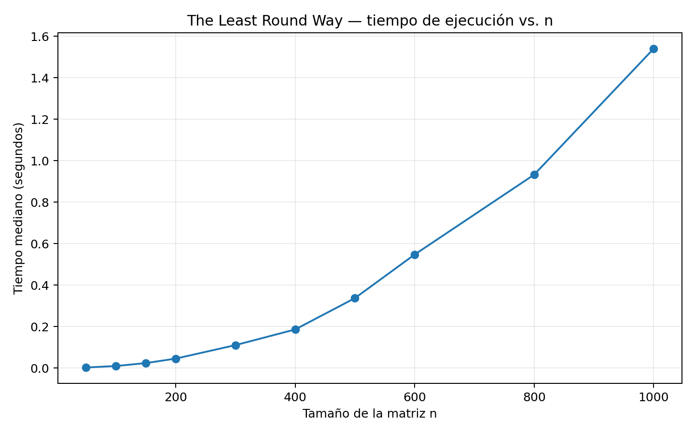

# Reporte: The Least Round Way

**Problema:** Codeforces 2B — *The Least Round Way*  
**Técnica:** Programación Dinámica — Top-Down con memoización  
**Dificultad:** 2000  
**Tags:** `dp`, `math`

---

## 1. Descripción del problema

Se entrega una matriz cuadrada:

\[
A[0..n-1][0..n-1]
\]

formada por enteros no negativos. Se debe encontrar un camino que comience en:

\[
(0,0)
\]

y termine en:

\[
(n-1,n-1)
\]

utilizando únicamente los movimientos:

- **D:** bajar desde \((i,j)\) hacia \((i+1,j)\);
- **R:** avanzar a la derecha desde \((i,j)\) hacia \((i,j+1)\).

Sea \(\mathcal P\) el conjunto de todos los caminos factibles entre estas dos esquinas. Todo \(P\in\mathcal P\) contiene exactamente \(n-1\) movimientos hacia abajo y \(n-1\) movimientos hacia la derecha.

Para un camino \(P\), definimos:

\[
Producto(P)=\prod_{(i,j)\in P}A[i][j]
\]

y sea \(Z(P)\) la cantidad de ceros finales de dicho producto. El problema consiste en:

\[
\boxed{\min_{P\in\mathcal P} Z(P)}
\]

y además se debe entregar un camino que alcance ese mínimo.

Las restricciones son:

\[
2\le n\le1000
\]

\[
0\le A[i][j]\le10^9
\]

### 1.1. ¿Qué determina la cantidad de ceros finales?

Un cero final aparece por cada factor:

\[
10=2\cdot5
\]

Por ejemplo:

\[
200=2^3\cdot5^2
\]

posee tres factores 2 y dos factores 5, por lo que solo pueden formarse dos parejas \(2\cdot5\). Entonces 200 tiene dos ceros finales.

Si \(v_2(x)\) y \(v_5(x)\) representan las cantidades de factores 2 y 5 de un entero positivo \(x\), respectivamente:

\[
Z(x)=\min(v_2(x),v_5(x))
\]

Por ello no es necesario multiplicar los valores del camino. Para cada celda positiva definimos:

\[
c_2(i,j)=v_2(A[i][j])
\]

\[
c_5(i,j)=v_5(A[i][j])
\]

y transformamos el problema en dos problemas aditivos:

1. encontrar el camino que acumula la menor cantidad de factores 2;
2. encontrar el camino que acumula la menor cantidad de factores 5.

**Caso especial.** La entrada permite celdas con valor 0. Como \(v_2(0)\) y \(v_5(0)\) no se tratan de la forma usual, los caminos que pasan por un cero se manejan por separado. Este caso se formaliza en las secciones 3.6 y 6.4.

### 1.2. Ejemplo: solución óptima y no óptima

Considérese:

```text
1    10    10
1     1    10
10    1     1
```

Un camino factible es `RRDD`:

```text
1 → 10 → 10
          ↓
          10
          ↓
           1
```

Su producto es:

\[
1\cdot10\cdot10\cdot10\cdot1=1000
\]

por lo que posee tres ceros finales.

En cambio, el camino `DRDR`:

```text
1
↓
1 → 1
    ↓
    1 → 1
```

tiene producto:

\[
1\cdot1\cdot1\cdot1\cdot1=1
\]

y, por tanto, cero ceros finales.

Así, `RRDD` es factible pero no óptimo y `DRDR` es óptimo. Además, \(0\) es necesariamente el mínimo posible, porque una cantidad de ceros finales nunca puede ser negativa.

---

## 2. Subestructura óptima

### 2.1. Decisión y alternativas

Supongamos que estamos en la celda:

\[
(i,j)
\]

La decisión es:

> **¿Cuál será el siguiente movimiento del camino?**

Existen, como máximo, dos alternativas:

```text
                    (i,j)
                   /     \
                  /       \
              ABAJO      DERECHA
                ↓            →
            (i+1,j)       (i,j+1)
```

**Alternativa 1: bajar**

\[
(i,j)\rightarrow(i+1,j)
\]

Queda el subproblema de encontrar el camino óptimo desde \((i+1,j)\) hasta el destino.

**Alternativa 2: avanzar a la derecha**

\[
(i,j)\rightarrow(i,j+1)
\]

Queda el subproblema de encontrar el camino óptimo desde \((i,j+1)\) hasta el destino.

Ambos subproblemas son del mismo tipo que el original y son estrictamente menores. Definimos:

\[
d(i,j)=(n-1-i)+(n-1-j)
\]

como la cantidad de movimientos restantes. Después de cualquiera de las dos decisiones:

\[
d'=d-1
\]

### 2.2. Cómo se combinan los subproblemas

Fijemos un factor:

\[
p\in\{2,5\}
\]

La celda actual aporta:

\[
c_p(i,j)
\]

factores \(p\).

Si bajamos, el costo es:

\[
c_p(i,j)+D_p(i+1,j)
\]

Si avanzamos a la derecha:

\[
c_p(i,j)+D_p(i,j+1)
\]

Como buscamos minimizar, combinamos ambas alternativas mediante:

\[
\min(D_p(i+1,j),D_p(i,j+1))
\]

Gráficamente:

```text
Costo de la celda actual
            +
     mejor continuación
        /        \
     abajo      derecha
```

### 2.3. Justificación de la subestructura óptima

Supongamos que una solución óptima desde \((i,j)\) comienza bajando hacia \((i+1,j)\).

Si la continuación desde \((i+1,j)\) no fuese óptima para ese subproblema, existiría otro camino desde \((i+1,j)\) hasta el destino con menor costo. Reemplazar la continuación original por esa mejor continuación mantendría el primer movimiento y la factibilidad del camino, pero reduciría el costo total.

Eso contradice que el camino inicial fuese óptimo.

El mismo argumento vale si la primera decisión es avanzar a la derecha.

Por lo tanto:

> **Una vez fijado el primer movimiento de una solución óptima, la parte restante debe ser una solución óptima del subproblema generado.**

---

## 3. Relación de recurrencia

### 3.1. Estado

Para un factor fijo \(p\in\{2,5\}\), definimos:

\[
D_p(i,j)
\]

como:

> La mínima cantidad de factores \(p\) que puede acumular un camino desde \((i,j)\) hasta \((n-1,n-1)\), incluyendo la celda actual.

Una vez fijado \(p\), el estado mínimo es únicamente:

\[
(i,j)
\]

No se necesita recordar el camino anterior ni el costo ya acumulado, porque todas las decisiones futuras dependen solamente de la posición actual.

### 3.2. Recurrencia y casos base

La recurrencia puede escribirse en una sola definición por casos:

\[
\boxed{
D_p(i,j)=
\begin{cases}
+\infty, & \text{si } i\ge n \text{ o } j\ge n,\\[4pt]
c_p(i,j), & \text{si } (i,j)=(n-1,n-1),\\[4pt]
c_p(i,j)+\min\left(D_p(i+1,j),D_p(i,j+1)\right),
& \text{en otro caso.}
\end{cases}
}
\]

El tercer caso se deduce directamente de las dos alternativas de la decisión: bajar o avanzar a la derecha.

### 3.3. Obtención de la respuesta para caminos positivos

Para un camino positivo \(P\), definimos:

\[
E_2(P)=\sum_{(i,j)\in P}c_2(i,j)
\]

\[
E_5(P)=\sum_{(i,j)\in P}c_5(i,j)
\]

Entonces:

\[
Z(P)=\min(E_2(P),E_5(P))
\]

Sean:

\[
m_2=\min_{P\in\mathcal P^+}E_2(P)
\qquad\text{y}\qquad
m_5=\min_{P\in\mathcal P^+}E_5(P)
\]

donde \(\mathcal P^+\) contiene los caminos cuyo producto es positivo.

Se obtiene:

\[
\boxed{
\min_{P\in\mathcal P^+}Z(P)=\min(m_2,m_5)
}
\]

Por lo tanto, para caminos positivos:

\[
\boxed{
mejorPositivo=\min(D_2(0,0),D_5(0,0))
}
\]

### 3.4. Verificación sobre un ejemplo pequeño

Considérese:

```text
2    10
5     4
```

Para factores 2:

```text
1    1
0    2
```

Por lo tanto:

\[
D_2(1,1)=2
\]

\[
D_2(1,0)=0+2=2
\]

\[
D_2(0,1)=1+2=3
\]

\[
D_2(0,0)=1+\min(2,3)=3
\]

Para factores 5:

```text
0    1
1    0
```

Entonces:

\[
D_5(1,1)=0
\]

\[
D_5(1,0)=1
\]

\[
D_5(0,1)=1
\]

\[
D_5(0,0)=0+\min(1,1)=1
\]

Finalmente:

\[
\min(3,1)=1
\]

El camino `DR` produce:

\[
2\cdot5\cdot4=40
\]

que tiene exactamente un cero final. La recurrencia alcanza su caso base y reproduce correctamente el óptimo.

### 3.5. Caso especial: celdas con valor 0

Las celdas con valor cero se consideran prohibitivamente costosas dentro de las DP de factores 2 y 5, de modo que \(D_2\) y \(D_5\) calculen el mejor camino **sin atravesar ceros**.

Paralelamente se almacena una posición cero \((z_i,z_j)\), si existe.

Existe siempre un camino monótono que pasa por esa posición:

```text
(0,0)
  ↓ ... ↓
(z_i,0) → ... → (z_i,z_j)
                    ↓ ... ↓
                 (n-1,z_j) → ... → (n-1,n-1)
```

Por tanto, si existe una celda cero, siempre puede construirse un camino factible que la atraviese.

Bajo la convención utilizada por el problema, dicho camino tiene costo 1. Así, si:

\[
mejorPositivo>1
\]

conviene usar el camino por cero. Si:

\[
mejorPositivo\le1
\]

el mejor camino positivo ya es igual o mejor.

---

## 4. Algoritmo Top-Down con memoización

Se utilizan dos tablas de memoización conceptuales, una para cada factor:

```text
memo[2][n][n]
memo[5][n][n]
```

Cada estado se inicializa con `-1`, que indica que todavía no ha sido resuelto. También se almacena la decisión que produjo el mínimo para reconstruir el camino.

### Pseudocódigo

```text
memo[p][i][j] = -1 para todo i,j
dir[p][i][j]  = NONE

function D(p, i, j):

    if i >= n or j >= n:
        return INFINITO

    if memo[p][i][j] != -1:
        return memo[p][i][j]

    if i == n-1 and j == n-1:
        memo[p][i][j] = c_p(i,j)
        return memo[p][i][j]

    abajo   = D(p, i+1, j)
    derecha = D(p, i, j+1)

    if abajo <= derecha:
        dir[p][i][j] = 'D'
    else:
        dir[p][i][j] = 'R'

    memo[p][i][j] =
        c_p(i,j) + min(abajo, derecha)

    return memo[p][i][j]
```

El algoritmo completo es:

```text
respuesta2 = D(2, 0, 0)
respuesta5 = D(5, 0, 0)

mejorPositivo = min(respuesta2, respuesta5)

if existe_cero AND mejorPositivo > 1:
    respuesta = 1
    camino = construirCaminoPorCero()
else:
    if respuesta2 <= respuesta5:
        respuesta = respuesta2
        camino = reconstruir(dir[2])
    else:
        respuesta = respuesta5
        camino = reconstruir(dir[5])
```

La correspondencia con la recurrencia es directa: `abajo` corresponde a \(D_p(i+1,j)\), `derecha` a \(D_p(i,j+1)\), y `min` implementa el operador de combinación.

En Python se aumenta además el límite de recursión, porque para \(n=1000\) una cadena de llamadas puede alcanzar una profundidad cercana a:

\[
2n-1=1999
\]

El notebook utiliza:

```python
sys.setrecursionlimit(1_000_000)
```

para evitar un `RecursionError` debido al límite predeterminado de Python.

---

## 5. Análisis del algoritmo

### 5.1. Número de subproblemas

El estado está determinado por \((i,j)\). Existen:

\[
n\cdot n=n^2
\]

estados para cada factor. Como se resuelve para \(p=2\) y \(p=5\):

\[
2n^2=O(n^2)
\]

estados en total.

### 5.2. Tiempo por subproblema

En cada estado se evalúan como máximo dos alternativas:

\[
D_p(i+1,j)
\qquad\text{y}\qquad
D_p(i,j+1)
\]

Sin contar el costo de las llamadas recursivas, cada estado realiza una cantidad constante de operaciones: consultas, comparación, suma, `min` y almacenamiento.

Por lo tanto:

\[
\boxed{O(1)}
\]

por subproblema.

### 5.3. Complejidad total

\[
T(n)=O(\#subproblemas\times trabajo\ por\ subproblema)
\]

\[
T(n)=O(n^2)\cdot O(1)
\]

por lo tanto:

\[
\boxed{T(n)=O(n^2)}
\]

El preprocesamiento de factores también recorre las \(n^2\) celdas. Como los valores están acotados por \(10^9\), la cantidad de divisiones por 2 o 5 por celda está acotada respecto de \(n\), por lo que mantiene la misma cota.

La reconstrucción del camino utiliza:

\[
2n-2=O(n)
\]

pasos.

La memoria queda dominada por las tablas:

\[
\boxed{O(n^2)}
\]

Además, el enfoque top-down utiliza una pila de llamadas de profundidad:

\[
O(n)
\]

porque cada llamada reduce en una unidad la distancia al destino y una rama puede contener a lo sumo \(2n-1\) estados.

### 5.4. Comparación con la recursión sin memoización

Sin memoización, un mismo estado se resuelve repetidamente:

```text
(0,0)
 /   \
D     R
|     |
(1,0) (0,1)
  \    /
   (1,1)
```

La cantidad de caminos monótonos completos es:

\[
\binom{2n-2}{n-1}
\]

que satisface asintóticamente:

\[
\binom{2n-2}{n-1}
=
\Theta\left(\frac{4^n}{\sqrt n}\right)
\]

salvo factores constantes y el desplazamiento del exponente.

Por ello la exploración recursiva ingenua tiene crecimiento exponencial. La memoización reduce el problema a los \(O(n^2)\) estados distintos.

---

## 6. Correctitud

### 6.1. Teorema para \(D_p(i,j)\)

Para todo estado válido \((i,j)\) y para \(p\in\{2,5\}\), \(D_p(i,j)\) es el mínimo número de factores \(p\) de cualquier camino permitido desde \((i,j)\) hasta \((n-1,n-1)\) que no atraviese una celda cero.

### 6.2. Demostración por inducción

Se utiliza inducción sobre:

\[
d(i,j)=(n-1-i)+(n-1-j)
\]

#### Caso base

Si:

\[
d(i,j)=0
\]

entonces:

\[
(i,j)=(n-1,n-1)
\]

No queda ninguna decisión pendiente. El único camino contiene la celda actual y su costo es:

\[
D_p(n-1,n-1)=c_p(n-1,n-1)
\]

Por lo tanto el caso base es correcto.

#### Hipótesis inductiva

Supongamos que \(D_p\) calcula correctamente el óptimo para todos los estados cuya distancia al destino sea menor que \(d\).

#### Paso inductivo

Sea \((i,j)\) un estado con distancia \(d>0\).

Todo camino factible debe comenzar exactamente con una de dos alternativas:

1. bajar hacia \((i+1,j)\);
2. avanzar hacia \((i,j+1)\).

Por hipótesis inductiva, \(D_p(i+1,j)\) y \(D_p(i,j+1)\) son los costos óptimos de las continuaciones correspondientes.

Por tanto, el mejor camino que comienza bajando tiene costo:

\[
c_p(i,j)+D_p(i+1,j)
\]

y el mejor que comienza a la derecha:

\[
c_p(i,j)+D_p(i,j+1)
\]

Estas alternativas son válidas y exhaustivas: todo camino comienza con una de ellas y no existe una tercera posibilidad.

Entonces el óptimo es:

\[
c_p(i,j)+\min(D_p(i+1,j),D_p(i,j+1))
\]

que coincide exactamente con la recurrencia.

Por inducción, \(D_p(i,j)\) es correcto para todos los estados.

### 6.3. Correctitud de la combinación de factores 2 y 5

Para cualquier camino positivo \(P\):

\[
Z(P)=\min(E_2(P),E_5(P))
\]

Sean:

\[
m_2=\min_{P\in\mathcal P^+}E_2(P)
\]

\[
m_5=\min_{P\in\mathcal P^+}E_5(P)
\]

Para todo camino positivo:

\[
E_2(P)\ge m_2
\qquad\text{y}\qquad
E_5(P)\ge m_5
\]

por lo que:

\[
Z(P)\ge\min(m_2,m_5)
\]

Por otra parte, un camino que alcanza \(m_2\) tiene:

\[
Z(P)\le m_2
\]

y uno que alcanza \(m_5\) tiene:

\[
Z(P)\le m_5
\]

Así existe un camino cuyo costo es a lo más \(\min(m_2,m_5)\). Junto con la desigualdad anterior:

\[
\boxed{
\min_{P\in\mathcal P^+}Z(P)=\min(m_2,m_5)
}
\]

Por tanto, `mejorPositivo` calculado por las dos DP es correcto.

### 6.4. Lema de correctitud del caso especial con cero

**Lema.** Si existe una celda cero \((z_i,z_j)\), el algoritmo puede construir un camino factible que pase por ella y dicho camino tiene costo 1 bajo la convención del problema.

**Demostración.**

Primero, siempre puede construirse un camino monótono desde el origen hasta \((z_i,z_j)\): basta realizar \(z_i\) movimientos hacia abajo y \(z_j\) hacia la derecha, en cualquier orden.

Desde \((z_i,z_j)\) hasta \((n-1,n-1)\) también existe un camino monótono, realizando:

\[
n-1-z_i
\]

movimientos hacia abajo y:

\[
n-1-z_j
\]

hacia la derecha.

Por tanto, existe un camino factible que atraviesa la celda cero. Su producto es 0 y, bajo la convención del problema, su costo es 1.

Ahora sea:

\[
b=mejorPositivo
\]

el mejor costo entre todos los caminos que evitan ceros.

- Si \(b>1\), el camino por cero tiene costo \(1<b\), por lo que es estrictamente mejor.
- Si \(b=1\), el camino positivo y el camino por cero empatan; devolver el positivo sigue siendo óptimo.
- Si \(b=0\), ningún camino puede tener un costo negativo, por lo que el camino positivo ya es estrictamente óptimo.

Así, cuando existe un cero:

\[
\boxed{OPT=\min(b,1)}
\]

y la condición:

```text
if existe_cero AND mejorPositivo > 1
```

elige exactamente la solución global correcta.

### 6.5. Teorema final

Por las secciones 6.2 y 6.3, el algoritmo calcula correctamente el mejor camino entre todos los caminos positivos. Por el lema de la sección 6.4, también compara correctamente ese óptimo con todos los caminos que atraviesan un cero.

Por tanto, el algoritmo devuelve un camino factible cuya cantidad de ceros finales es mínima entre **todos** los caminos posibles de la instancia.

---

## 7. Experimentos

Los experimentos se realizaron con la implementación Top-Down disponible en el repositorio.

### 7.1. Ambiente y metodología

Las mediciones de esta versión se realizaron con:

- **Python:** 3.13.5
- **Plataforma:** `Linux-6.18.44-x86_64-with-glibc2.41`
- **Límite de recursión:** `1_000_000`
- **Semilla aleatoria:** `20261005`
- **Valores de las matrices:** enteros aleatorios entre \(1\) y \(10^9\)
- **Repeticiones por tamaño:** 3
- **Estadístico reportado:** mediana

La semilla fija permite generar las mismas instancias al volver a ejecutar el notebook. Los tiempos absolutos pueden variar entre equipos, pero la tendencia respecto de \(n\) es la magnitud relevante para contrastar la complejidad asintótica.

### 7.2. Pruebas de correctitud

#### Caso 1 — Ejemplo oficial

**Entrada:**

```text
3
1 2 3
4 5 6
7 8 9
```

**Salida obtenida:**

```text
0
DDRR
```

El camino produce:

\[
1\cdot4\cdot7\cdot8\cdot9=2016
\]

que no termina en cero. Como el costo no puede ser negativo, 0 es necesariamente óptimo.

#### Caso 2 — Todos los elementos son múltiplos de 10

**Entrada:**

```text
2
10 10
10 10
```

**Salida obtenida:**

```text
3
DR
```

Todo camino visita tres celdas y produce:

\[
10^3=1000
\]

por lo que cualquier camino tiene exactamente tres ceros finales.

#### Caso 3 — Cero útil

**Entrada:**

```text
3
1 10 1
1  0 1
10 10 10
```

**Salida obtenida:**

```text
1
DRDR
```

El camino atraviesa la celda central cero. Por el lema de la sección 6.4, el algoritmo compara correctamente ese camino de costo 1 con el mejor camino positivo.

#### Caso 4 — Sin factores 2 ni 5

**Entrada:**

```text
2
1 1
1 1
```

**Salida obtenida:**

```text
0
DR
```

Todo camino tiene producto 1 y, por lo tanto, cero ceros finales.

### 7.3. Tiempo de ejecución

Los tiempos medidos fueron:

| \(n\) | Tiempo mediano |
|---:|---:|
| 50 | 0.002981 s |
| 100 | 0.010038 s |
| 150 | 0.024142 s |
| 200 | 0.045686 s |
| 300 | 0.110732 s |
| 400 | 0.186260 s |
| 500 | 0.337303 s |
| 600 | 0.547510 s |
| 800 | 0.932527 s |
| 1000 | 1.539620 s |

El experimento incluye ahora:

\[
n=1000
\]

que corresponde al máximo permitido por el enunciado.



### 7.4. Análisis del gráfico

El gráfico presenta un crecimiento compatible con una función cuadrática.

Si el tiempo fuese exactamente proporcional a \(n^2\), duplicar \(n\) debería multiplicar aproximadamente por cuatro el trabajo. Las mediciones no producen razones exactamente iguales a cuatro debido a factores de ejecución real —memoria, caché, recolección de basura e interpretación de Python—, pero el crecimiento general sigue la tendencia esperada.

La razón teórica es que al aumentar \(n\), la cantidad de estados crece como:

\[
n^2
\]

y cada estado realiza:

\[
O(1)
\]

trabajo propio.

La ejecución para \(n=1000\) confirma además que el enfoque top-down puede alcanzar el tamaño máximo del problema en este entorno sin producir `RecursionError`, gracias al ajuste explícito del límite de recursión.

Por tanto, la evidencia experimental es consistente con:

\[
\boxed{T(n)=O(n^2)}
\]

### 7.5. Código y reproducibilidad

El repositorio público contiene el reporte, el notebook con la implementación y los experimentos, y el gráfico:

[**Código y experimentos en GitHub**](https://github.com/Klonoh/Problema-6--The-Least-Round-Way)

Para mantener la versión entregada completamente reproducible, el notebook debe contener la misma lista de tamaños utilizada en esta sección, incluyendo \(n=1000\), y el archivo del gráfico debe conservar el nombre `tiempo.png`.

---

## 8. Conclusión

*The Least Round Way* posee subestructura óptima porque, una vez fijado el primer movimiento, la continuación de una solución óptima debe ser óptima para el subproblema resultante.

Para cada factor \(p\in\{2,5\}\), la recurrencia es:

\[
D_p(i,j)=
c_p(i,j)+
\min(D_p(i+1,j),D_p(i,j+1))
\]

con los casos base descritos anteriormente.

La memoización reduce una exploración recursiva de crecimiento exponencial a:

\[
\boxed{O(n^2)}
\]

tiempo y:

\[
\boxed{O(n^2)}
\]

memoria, además de una pila recursiva de profundidad \(O(n)\).

La demostración por inducción garantiza la correctitud de las DP para factores 2 y 5, y el lema adicional del caso cero demuestra que el algoritmo completo —incluyendo su rama especial— devuelve una solución globalmente óptima.

Finalmente, las pruebas funcionales y las mediciones hasta \(n=1000\) son coherentes con el análisis teórico.

---

## Referencias

- [Codeforces 2B — The Least Round Way](https://codeforces.com/problemset/problem/2/B)
- [Codeforces Beta Round #2 — Another Tutorial](https://codeforces.com/blog/entry/107)
